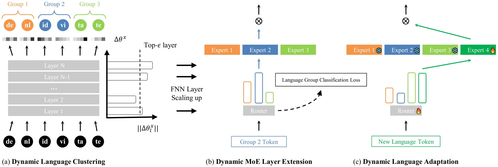

# Group then Scale: Dynamic Mixture-of-Experts Multilingual Language Model

The code for the ACL 2025 conference paper "**Group then Scale: Dynamic Mixture-of-Experts Multilingual Language Model**".

## Overview
To address the curse of multilinguality phenomenon, we propose a method to dynamically group and scale up the parameters of multilingual LLM while boosting positive transfer among similar languages. Specifically, the model is first tuned on monolingual corpus to determine the parameter deviation in each layer and quantify the similarity between languages. Layers with more deviations are extended to mixture-of-experts layers to reduce competition between languages, where one expert module serves one group of similar languages. The following figure illustrates the frameworks of DMoE:



## How to run?

### Set up an virtual environment
```
conda create -n DMoE python=3.10
conda activate DMoE
pip install -r requirements.txt
```

### Prepare multilingual corpus

Download and organize multilingual texts into jsonl format, where one dict with a key "text" composes a line, from [CulturaX](https://huggingface.co/datasets/uonlp/CulturaX) and [MADLAD-400](https://huggingface.co/datasets/allenai/MADLAD-400). We save these files in the "data/source/CulturaX/{language-id}.json" or "data/source/MADLAD-400/{language-id}.json" directory. There are 1k line samples from CulturaX provided in the "data/source/CulturaX-1k-samples" directory for example. 

### Statistic the parameter deviation and cluster similar languages

```
cd scripts
# Fine-tune on each language, save parameter deviation and cluster similar languages
vim finetune_18langs.sh
bash finetune_18langs.sh
```

### Dynamic MoE layer extension

```
cd scripts
# Determine the layer of base model to extend.
vim stat_layer_extend.sh
bash stat_layer_extend.sh

# Merge multiple models into DMoE.
vim merge_model.sh
bash merge_model.sh

# Set up your private parameters, e.g., the path of DMoE and tokenized dataset.
vim train_dmoe.sh
bash train_dmoe.sh
```

### Dynamic language adaptation

```
cd scripts
# Prepare the dataset with new language corpus and eval the perplexity of each expert by hard routing to find the most similar expert (eval_expert_ppls).
vim eval_ppl.sh
bash eval_ppl.sh

# Set up your private parameters, e.g., the path of DMoE to be extended and the id of expert copied.
vim add_expert.sh
bash add_expert.sh

# Train the specific added expert for new language adaptation
vim new_lang_adapt.sh
bash new_lang_adapt.sh
```

## 📎 Models

We open-source the following model weights:

|              **Name**              |   **Path**   |
|:----------------------------------:|:------------:|
| DMoE-Bloom-560M-16Experts-128Langs | [🤗Huggingface](https://huggingface.co/chongli17/DMoE-Bloom-560M-16Experts-128Langs) |
| DMoE-Bloom-1.7B-16Experts-128Langs | [🤗Huggingface](https://huggingface.co/chongli17/DMoE-Bloom-1.7B-16Experts-128Langs) |

## How to cite our paper?
```
@inproceedings{li-etal-2025-DMoE,
  author    = {Chong Li and
               Yingzhuo Deng and
               Jiajun Zhang and
               Chengqing Zong},
  title = "Group then Scale: Dynamic Mixture-of-Experts Multilingual Language Model",
  booktitle = "Findings of the Association for Computational Linguistics: ACL 2025",
  year = "2025",
  address = "Vienna, Austria",
  publisher = "Association for Computational Linguistics",
}
```